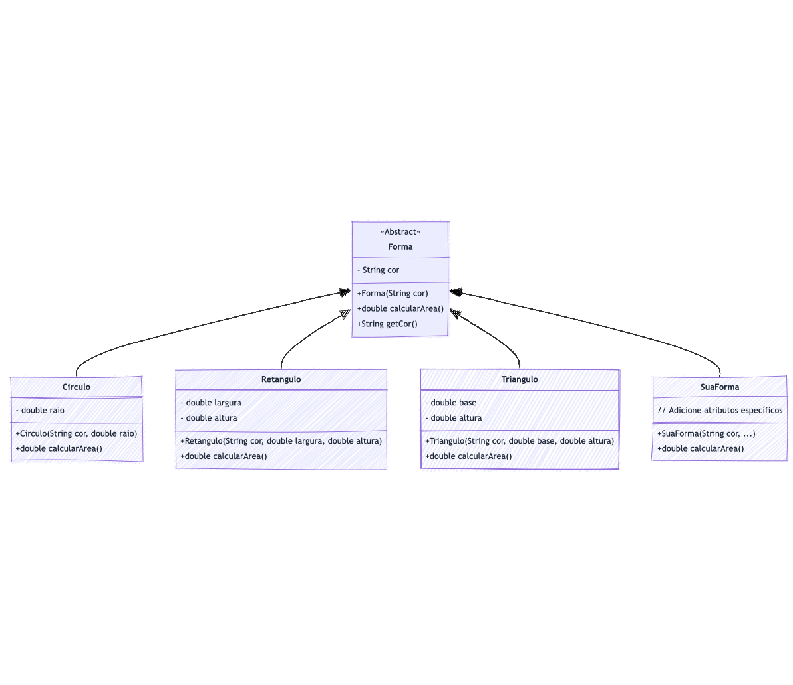

# Abstração com Abstract Classes 
Atividade livre para consolidação de conhecimento através de prática com código Java.

Para auxiliar na compreensão da estrutura do código e das relações entre as classes implementadas neste repositório, apresentamos abaixo o diagrama de classes:

Este diagrama ilustra a hierarquia de classes e demonstra como a abstração é aplicada através da definição da classe abstrata `Forma` e suas subclasses concretas. Cada classe representada no diagrama corresponde a um arquivo de código presente no repositório, permitindo uma visualização clara das interações e dependências entre elas.

#### **Sua Tarefa**

- **Crie uma nova classe** que estende `Forma`, como `Quadrado`, `Pentagono`, etc.
- **Implemente o método abstrato `calcularArea()`** na sua classe para calcular a área da forma geométrica escolhida.
- **Instancie sua classe** em `Main.java` e adicione ao array `formas`.
- **Execute o programa** e verifique se a área da sua forma é exibida corretamente.