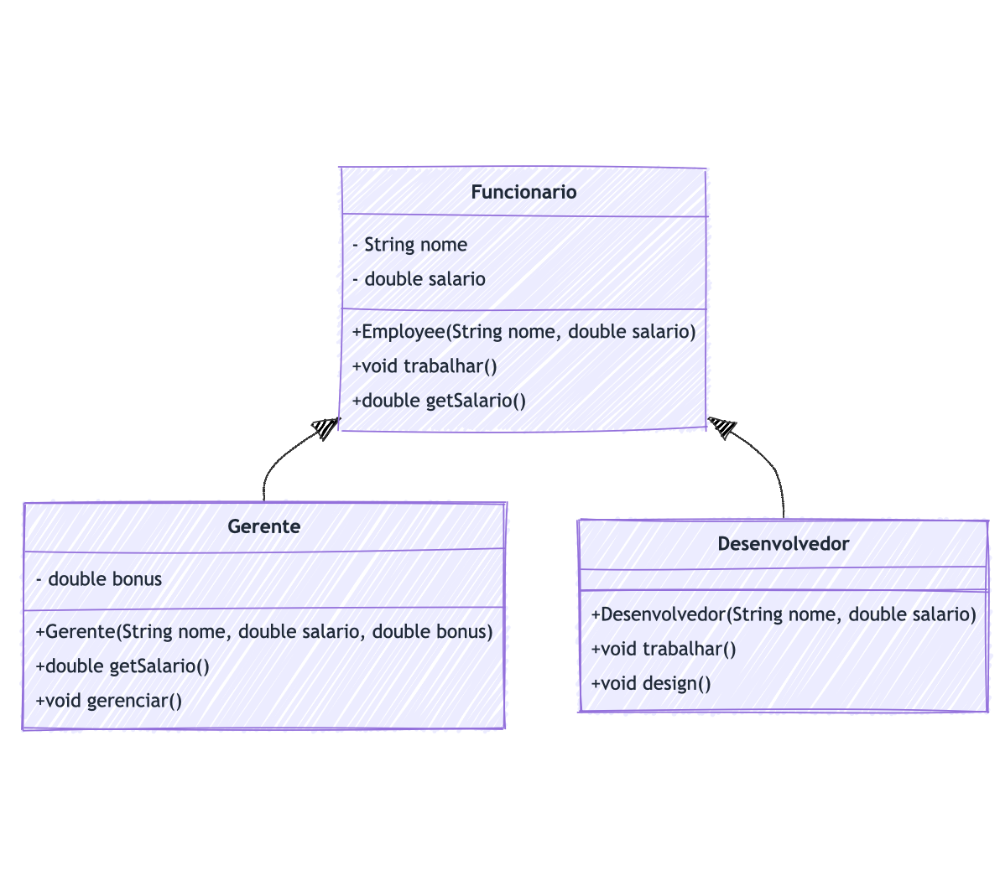

# Herança

Atividade livre para consolidação de conhecimento através de prática com código Java.

Para facilitar a compreensão da estrutura do código e das relações entre as classes implementadas nesta atividade, apresentamos abaixo o diagrama de classes:

Este diagrama ilustra a hierarquia de classes e demonstra como a herança é aplicada através da extensão da classe Employee por outras classes específicas de funcionários. Cada classe representada no diagrama corresponde a um arquivo de código presente no repositório, permitindo uma visualização clara das interações e dependências entre elas.

#### **Sua Tarefa**

- **Crie uma nova classe** que estende `Funcionario`, como `Analista`, `Testador`, `Estagiario`, etc.
- **Adicione propriedades** e métodos específicos à sua classe que reflitam as responsabilidades desse cargo.
- **Sobrescreva métodos** se necessário, como `trabalhar()`, para especificar as atividades do seu funcionário.
- **Instancie sua classe** em `Main.java` e adicione a chamada ao métodos `trabalhar` e `getSalario`.
- **Execute o programa** e verifique se o comportamento do seu objeto está conforme o esperado.
