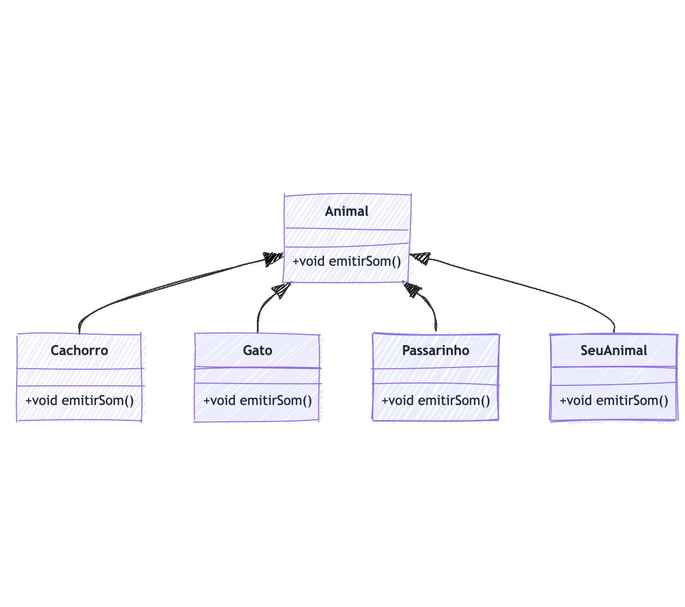

# Polimorfismo

Atividade livre para consolidação de conhecimento através de prática com código Java.

Para facilitar a compreensão da estrutura do código e das relações entre as classes implementadas nesta atividade, apresentamos abaixo o diagrama de classes:

Este diagrama ilustra a hierarquia de classes e demonstra como o polimorfismo é aplicado através da herança e sobrescrita de métodos. Cada classe representada no diagrama corresponde a um arquivo de código presente no repositório, permitindo uma visualização clara das interações e dependências entre elas.

#### **Sua Tarefa**

- **Crie uma nova classe** que estende `Animal`, como `Vaca`, `Leao`, `Sapo`, etc.
- **Sobrescreva o método `emitirSom()`** na sua classe para que imprima o som característico do animal escolhido.
- **Instancie sua classe** em `Main.java` e adicione ao array `animais`.
- **Execute o programa** e verifique se o som do seu animal é exibido corretamente.
